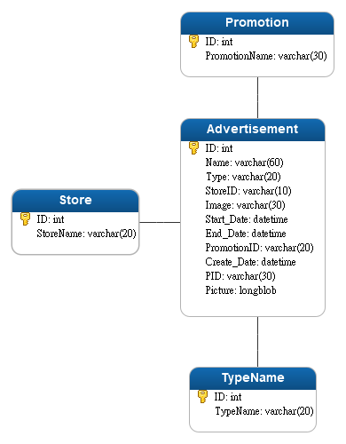

***先勁手機平台廣告推播資料庫規格書***

  **日期**    **版本**    **修改內容**
  ----------- ----------- --------------
  2020/5/28   V1.0.0.01   初版
                          

目錄
====

[目錄](#_Toc41641655)

[一、資料庫關係圖](#一資料庫關係圖)

[二、資料庫規格](#二資料庫規格)

[廣告](#廣告)

[廣告板位名稱](#廣告板位名稱)

[促銷代號名稱](#促銷代號名稱)

[分店代號名稱](#_Toc41641661)

一、資料庫關係圖
================

**廣告關係圖:**

)

二、資料庫規格
==============

廣告
----

  |資料表名   |Advertisement   |中文名  | 廣告|
  |----------|---------------|--------|------|
  |建檔日     |2020/05/28      |修改日  | |
  |說明       |廣告推播用 ||              

| SEQ    | 欄位名稱     | Len | 欄位標題     | 格式   | Key | 預設值 | 備註 |
|--------|--------|-----|--------|--------|-----|--------|------|
| 1.     | ID     | 11  | 預設編號     | UINT   | Yes | Not Null   |      |
| 2.     | Name   | 60  | 廣告名稱     | VARCHAR      |     | Null   |      |
| 3.     | Type   | 20  | 版面代號     | VARCHAR      |     | Null   |      |
| 4.     | S      | 10  | 分店代號     | VARCHAR      |     | Null   |      |
| 5.     | Image  | 30  | 檔案名稱     | VARCHAR      |     | Null   |      |
| 6.     | Start_Date  |     | 上架日期     | DATETIME     |     | Null   |      |
| 7.     | End_Date    |     | 下架日期     | DATETIME     |     | Null   |      |
| 8.     | PromotionID  | 20  | 促銷代號     | VARCHAR      |     | Null   |      |
| 9.     | Create_Date |     | 建檔日期     | DATETIME     |     | Null   |      |
| 10.    | PID    | 30  | 建檔人員     | VARCHAR      |     | Null   |      |
| 11.    | Picture      |     | 圖檔   | LONGBLOB     |     | Null   |      |

廣告板位名稱
------------

  |資料表名   |TypeName               |中文名   |廣告版位名稱|
  |----------|----------------------|--------|--------------|
  |建檔日     |2020/05/28             |修改日  | |
  |說明       |廣告推播用, 顯示中文            ||

| SEQ  | 欄位名稱 | Len | 欄位標題 | 格式    | Key | 預設值   | 備註 |
|------|---------------|-----|----------|---------|-----|----------|------|
| 12.  | ID       | 11  | 預設編號 | UINT    | Yes | Not Null |      |
| 13.  | TypeName | 20  | 板位名稱 | VARCHAR |     | Null     |      |

促銷代號名稱
------------

  |資料表名   |Promotion              |中文名   |促銷代號名稱|
  |----------|----------------------|--------|--------------|
  |建檔日     |2020/05/28             |修改日   ||
  |說明       |廣告推播用, 顯示中文      |      ||

| SEQ  | 欄位名稱      | Len | 欄位標題 | 格式    | Key | 預設值   | 備註 |
|------|---------------|-----|----------|---------|-----|----------|------|
| 1.   | ID            | 11  | 預設編號 | UINT    | Yes | Not Null |      |
| 2.   | PromotionName | 30  | 促銷名稱 | VARCHAR |     | Null     |      |

分店代號名稱
------------

  |資料表名   |Store                  |中文名   |分店代號名稱|
  |----------|----------------------|--------|--------------|
  |建檔日     |2020/05/28             |修改日  | |
  |說明       |廣告推播用, 顯示中文      |      ||

| SEQ  | 欄位名稱  | Len | 欄位標題 | 格式    | Key | 預設值   | 備註 |
|------|-----------|-----|----------|---------|-----|----------|------|
| 3.   | ID        | 11  | 預設編號 | UINT    | Yes | Not Null |      |
| 4.   | StoreName | 20  | 分店名稱 | VARCHAR |     | Null     |      |
